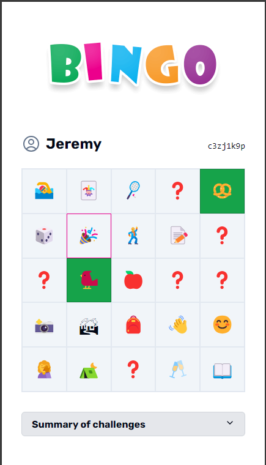

# Remix Bingo

This is a Bingo game built in Remix, originally built for guests of my wife's birthday weekend.

Built with [Remix](https://remix.run), React, TypeScript, ShadCN and Radix components, with Prisma over an SQLite database, ready to be hosted on [Fly](https://fly.io).

> [!IMPORTANT]
> This project has no security features built-in (for example, anyone can edit anyone's grid, mark items as completed, and so on) and is not ready for production as-is, except for a very limited and trusted audience.

## Setup steps

- Run `npm install`
- Setup your Bingo items in `prisma/seed.ts`
- Initialize your database with `npx prisma migrate dev --name init`. This creates your SQLite database and initializes it with the schema and seed data
- Run the project locally `npm run dev`
